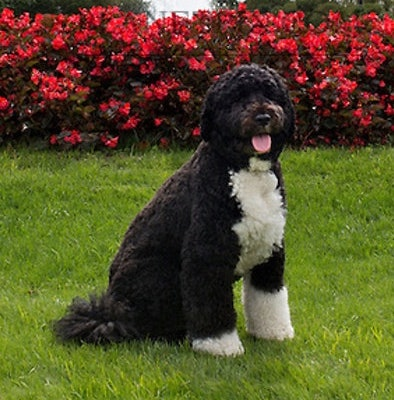

# Bo / Not Bo Image Classification with Transfer Learning 🐶🚪

This project implements a binary image classification model designed to control access through an automated dog door.  
The system distinguishes between an authorized subject (the President’s dog) and all other objects or animals, ensuring that only the intended target can trigger the door mechanism.  

The project demonstrates how a real-world access control problem can be framed as a supervised computer vision task using transfer learning.

<p align="center">
  
</p>

---

## Project Overview

- **Task:** Binary image classification (`bo` vs `not_bo`)
- **Model:** VGG16 pretrained on ImageNet
- **Framework:** PyTorch + TorchVision
- **Training Strategy:**
  - Freeze pretrained feature extractor
  - Train custom classification head
  - Optional fine-tuning with a low learning rate
- **Hardware:** GPU-accelerated training (recommended)

---

## Model Architecture

- Pretrained **VGG16** convolutional backbone
- Custom fully connected classifier:
  - Flatten layer
  - Dense layer with ReLU activation
  - Final output layer with 2 logits (binary classification)

The pretrained layers capture general visual features, while the custom head learns task-specific representations.

---

## Data Preprocessing & Augmentation

- Input images resized to **224 × 224**
- RGB images preserved (no grayscale conversion)
- Light geometric augmentations applied during training:
  - Random horizontal flip
  - Small rotations
  - Minor affine transformations

Color-based augmentations (e.g. `ColorJitter`) were intentionally avoided to preserve semantic color information relevant to classification.

---

## Dataset

The dataset used in this project is **not included** in the repository.

The data was provided as part of an **NVIDIA Deep Learning Institute** course and is not publicly redistributable. The dataset consists of labeled images organized into two classes: `bo` and `not_bo`.

To reproduce the results, a dataset with the following structure can be used:

```text
data/
├── train/
│   ├── bo/
│   └── not_bo/
└── valid/
    ├── bo/
    └── not_bo/
```
## 💻 Hardware & CUDA Support

This project supports both **CPU and GPU** execution.

- **CUDA-enabled NVIDIA GPU is recommended** for training (much faster).
- **CPU-only systems can still run the notebook**, but training will be significantly slower.
- The code automatically selects the available device:

```python
device = torch.device("cuda" if torch.cuda.is_available() else "cpu")
```
## Conclusion

This project showcases the effectiveness of transfer learning for binary image classification using a pretrained VGG16 model. By freezing pretrained features and selectively fine-tuning, the model achieved strong performance on a limited dataset, demonstrating a practical and scalable deep learning workflow.
